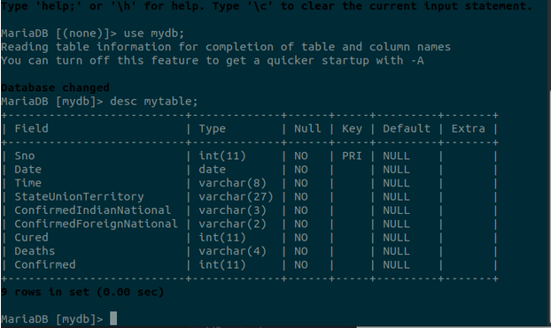
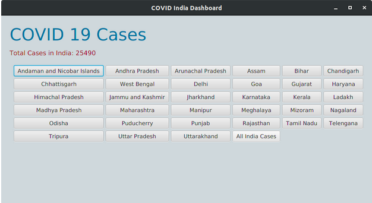
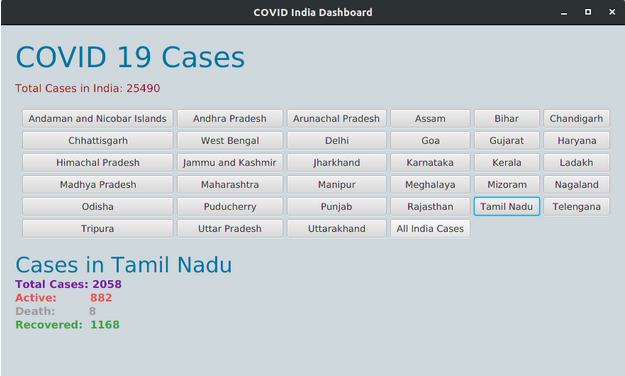
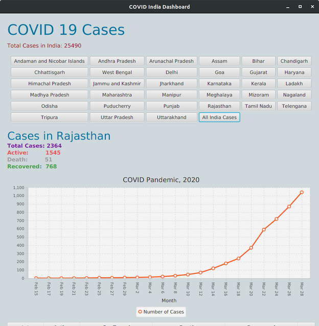
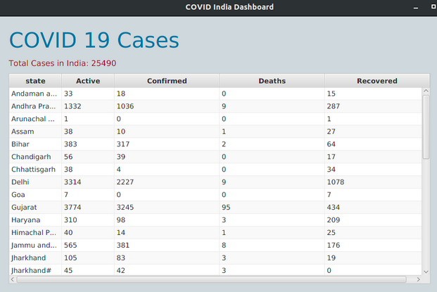

# COVID 19 Dashboard on JavaFX

Created for Digital Assignment 3 for Course in Java Programming.

## Screenshots

Following is the table structure for the COVID table from which the queries are being made.

This is the user interface designed for COVID 19 Cases. There is a corresponding button for every state and union territory which triggers an event to display the total cases statistics of the corresponding state/union territory. There is also a All India Cases“” button that generates a graph of all cases in India per day.

On selecting Tamil Nadu, it shows the Total, Active, Death and Recovered Cases of the state.

On clicking All India Cases, the following Line graph is generated that shows the linear distribution of cumulative number of cases versus day of month.

Table displaying cases from different States
